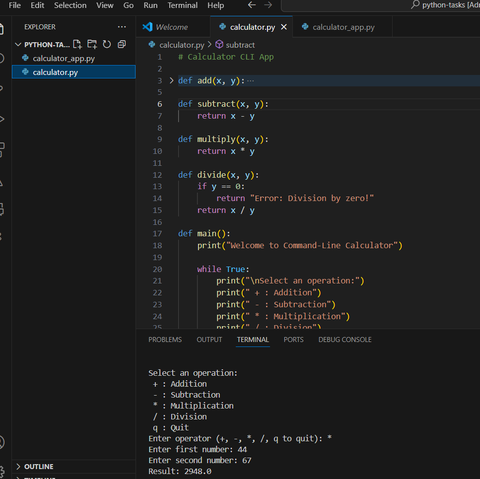

# Calculator CLI App
A simple Python-based command-line calculator that performs basic arithmetic operations. The app runs in a loop until the user chooses to quit. Perfect for beginners learning Python and command-line interaction.

# 🧮 Command-Line Calculator in Python

A simple and interactive command-line calculator built using Python. This program allows users to perform basic arithmetic operations like addition, subtraction, multiplication, and division repeatedly until they choose to exit.

## 📸 Screenshot

## 🔧 Features

- Addition, Subtraction, Multiplication, Division
- Input validation for numeric values
- Handles division by zero
- Runs in a loop until the user exits
- Beginner-friendly and well-commented
